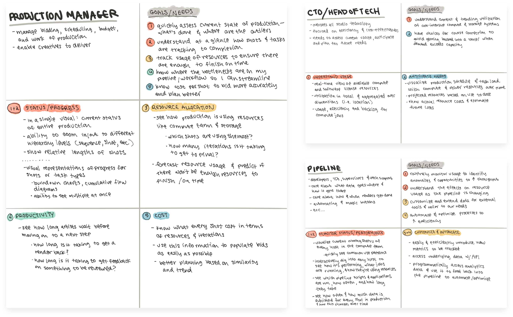
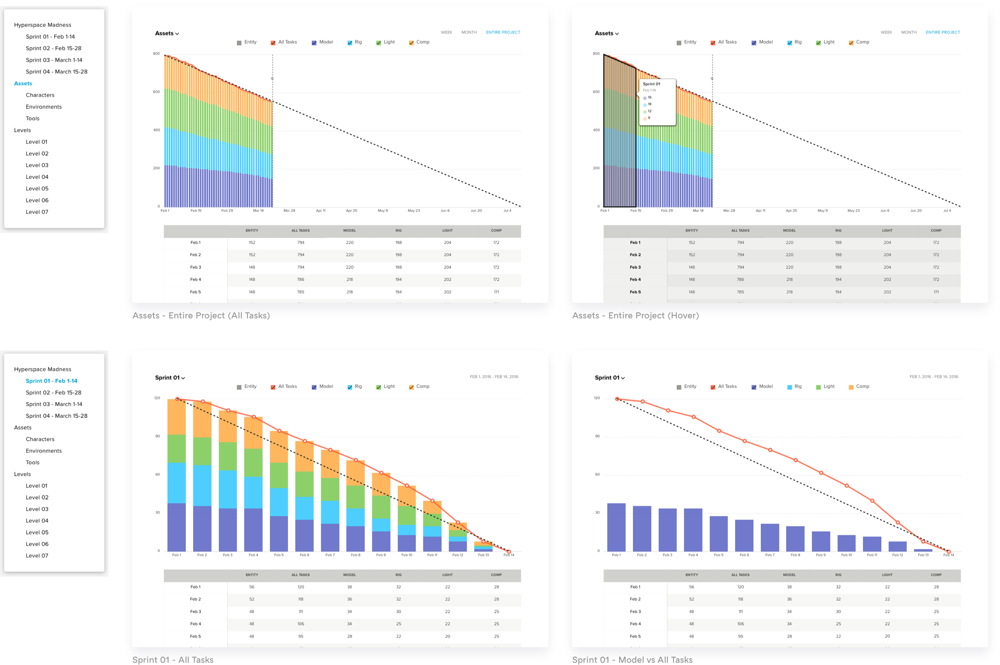
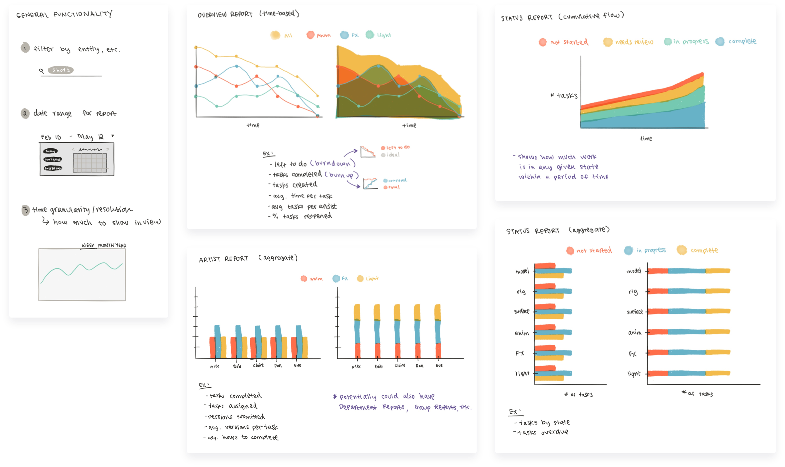
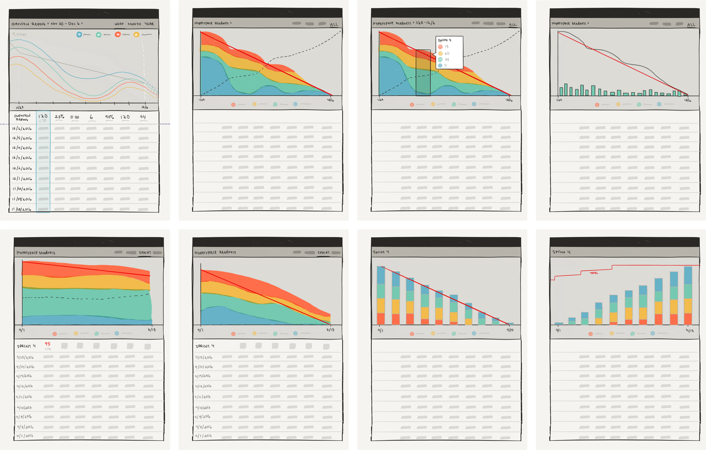
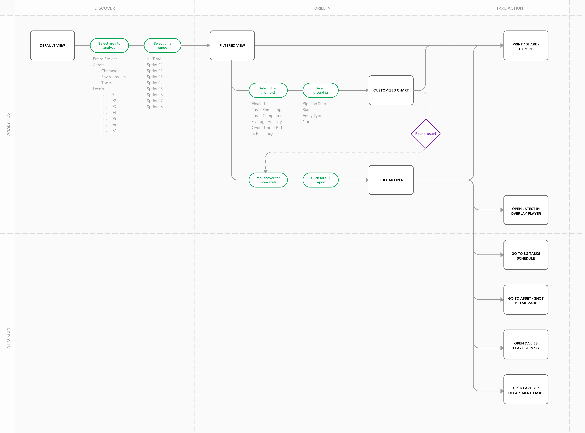
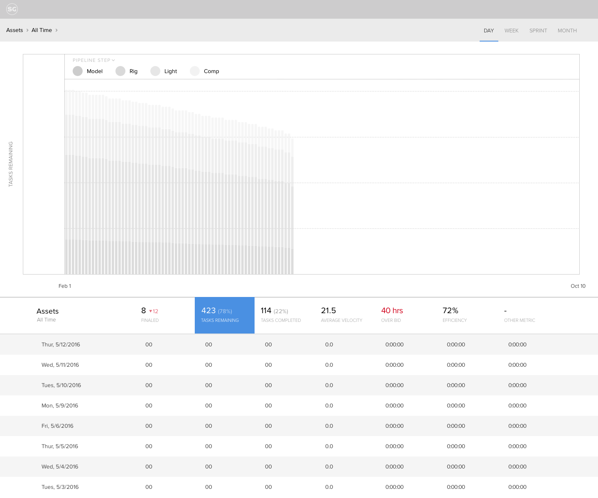
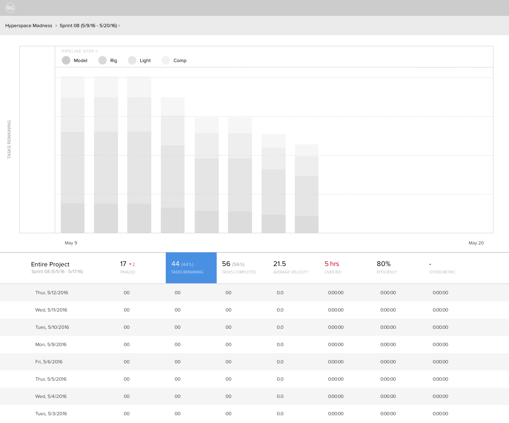
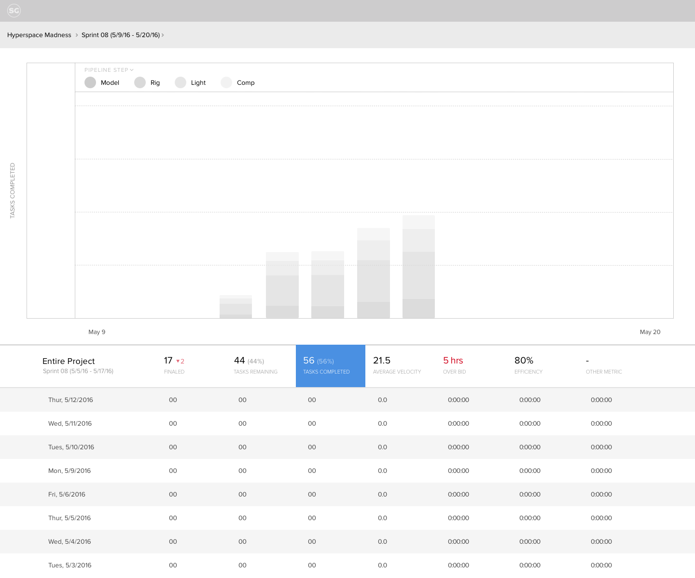

# Shotgun Production Insights

## A powerful way to visualize production data in Shotgun

[Production Insights](https://www.shotgunsoftware.com/blog/shotgun-76-introduces-production-insights/) are a new set of analytics and reporting tools that give studios the ability to visualize key production metrics, keep a close eye on the progress of their projects, and make business-critical decisions before they snowball.

**Timeline**
2016-2017

**Role**
Interaction Designer

**Agency**
EPIC

### The Problem

The growing demand and complexity of visual effects work has production houses looking for every possible way to streamline their workflow. Getting the work done in an efficient and cost-effective manner means coordinating between different sites, departments, artists, and locations. Producers are working around-the-clock to keep up with scheduling demands and the current marketplace of tools isn’t meeting their needs.

### Goal

EPIC was brought on to translate dense engineering requirements into an intuitive, out-of-the-box experience. The goal was to give studio leaders a high-level overview of the health of their projects, with the ability to dive into details to see how time and resources are used. We wanted to help streamline studio operations by removing guesswork, turning production data into real insights to make better decisions, faster.

### My Role

This project 6-week project was unusual in that we didn't have a product person assigned to our team. From EPIC, it was me and Andrew Peters, the Director of Design. Phil Peterson from Shotgun was the project lead. We also collaborated with a few members from the Street Team. It was mostly remote but we had meetings on-site once a week.

### Challenge

The most challenging part of this project was alignment on vision. It was born in production as a tool to handle the demands placed on studio render farm infrastructure. While hardware resources were still meant to be a part of the end-goal for the app, Shotgun wanted us to focus on the people resources side of the problem.

### Process
#### I converted technical specs into personas.

Shotgun has a wealth of data to extract, analyze, and visualize to provide meaningful information. Their team recognized an opportunity and had already done some research by the time we came on board. I condensed their research into digestible personas to gain alignment and define our scope.

## I charted production status over time in Numbers.

We started by focusing on burndown charts, specifically in the context of game development. To get a better understanding of the numbers driving the visuals, I created a spreadsheet with idealized values to test if anything breaks in its simplest form. It became clear that our biggest challenge would be hierarchy:

- It's as valuable to see a sprint’s task breakdown as it is to see and forecast progress over the entire project.
- A task can be associated with an entity directly [i.e. Level 01 - Script] or as a child of one of its pipeline steps [i.e. Level 01 \> Rigging - Advanced].

 

## I researched types of reports and defined possible metrics.

Shotgun had recently audited the thousands of metrics tracked through their system. To supplement their research, I scoured industry publications for anything related to production data, vfx pipelines, and workflow efficiency. I learned that we had been ignoring an important piece of the puzzle: the people doing the work. Central to a smooth-running pipeline was the flexibility and foresight to scale a production team up or down based on changes in workload.
 

## I explored different ways we could slice up the data.

After getting buy-in from the team about our expanded scope, I started thinking about how we could integrate everything into one a cohesive system. We didn’t want to create an infinitely customizable dashboard. We had a unique opportunity to define industry standards by being intentional about which metrics to analyze and how to display them.
 

## I positioned the app within the Shotgun ecosystem.

Our goal was to enable the early discovery of bottlenecks, provide a way to drill into them, and lead to an appropriate fix or adjustment in Shotgun. It was particularly important to direct our users to the areas needing attention. We learned that sometimes they would come into the app from a place of curiosity and other times they would be looking for something specific. Either way, they would need to know if there were any major fires to put out.
 

---- 
### Results

## Ability to zoom in

## View different metrics

## Hover for details - report opens in sidebar

