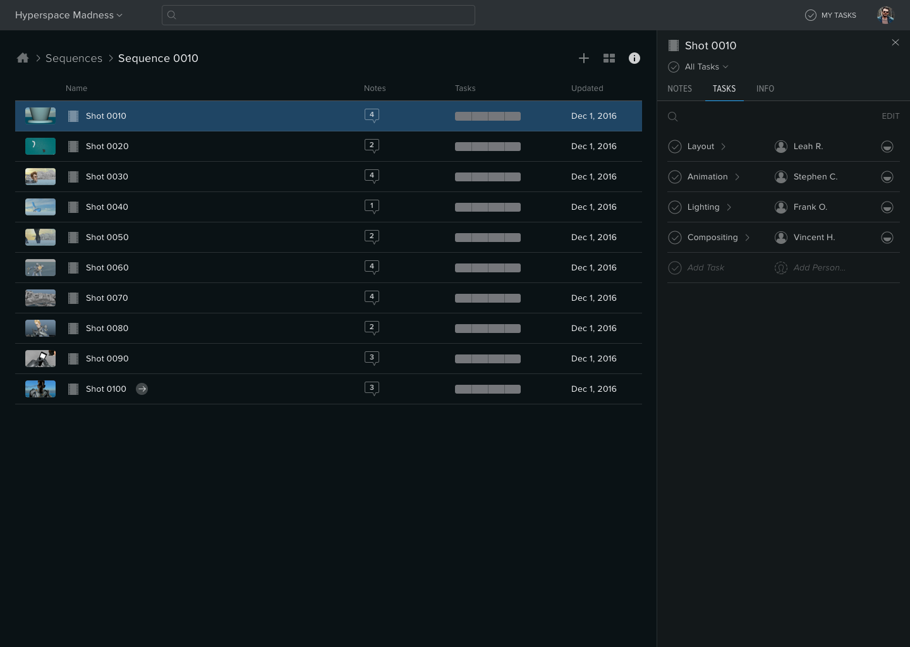
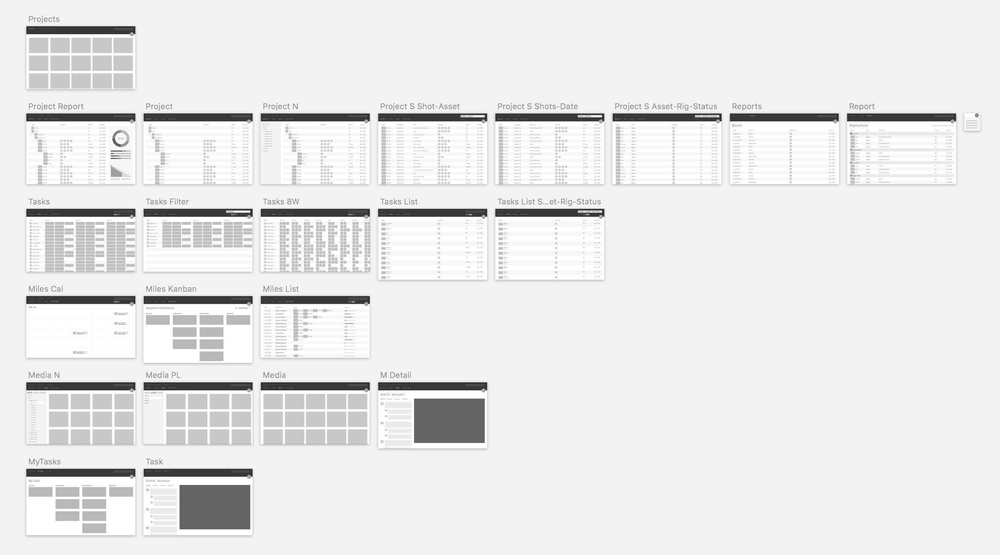

# Shotgun X
A collection of projects that spanned the course of 10 months. At a high level, we were rethinking Shotgun as a platform and ecosystem. The goal was to design a dramatically improved and simplified experience for creating a project, organizing it, and adding or assigning people.

**Timeline**
2016

**Role**
Senior Product Designer

**Agency**
EPIC

### My Role

***I partnered with Shotgun to rethink its core platform and improve the onboarding experience for new users.*** We tackled challenges common to many enterprise products: feature-driven design decisions, information density, hierarchy issues, inconsistent UI conventions, and the absence of a common visual language.

Collectively, these projects contributed to a 50% improvement through key parts of the onboarding funnel.

### The Problem

Over the years, Shotgun's accumulated an arsenal of products in their suite of offerings, many of which have overlapping, competing functionality. Their flagship product has bloated from regular feature additions, rendering the web app slow to load and overwhelming to learn.

The onboarding and setup flow was in serious trouble. There were too many steps required to setup a project and not enough clarity on what to do next after you do. New users got lost and confused in the process, causing them to abandon the product. Existing users were spending a lot of time getting things set up, causing them to see Shotgun as an app only for big projects.

In 2016, Shotgun conducted a free trial experience study. The numbers speak for themselves:

---- 
# Electric Boogaloo

The first incarnation of the project was launched in January 2016 after Shotgun brought on an Autodesk researcher to conduct a First Experience Study. Users were introduced to Shotgun for the first time and asked to create a project from scratch.

The researcher identified several opportunities for improvement. Shotgun turned to EPIC to develop an InVision prototype focused on the workflow of setting up a project.

At this point our team was small. There were three of us: Ben, a product manager from Shotgun, Andrew, EPIC’s creative director, and me.

## Initial Concepts

Before we could dive into designing a flow for creating a project, we had to get clear on the things a project contains. With Ben’s help, we blocked out quick and dirty wireframes illustrating the high level areas of a project.

---- 
## Early Wireframes

The goal was to design ***a standalone task tracking app targeting supervisors, producers, and managers***—since they would be the ones most invested in easy project setup and task assignment. The initial spec included their key actions in each area:

Project

- Break down a project into entities / steps / tasks
- Organize into a hierarchy
- Assign tasks
- Get an overview of status
- Quickly find what you’re looking for

Tasks

- See your team and the tasks they’re assigned
- Assign tasks by drag and drop
- Change task dates by drag and drop

Media

- View the latest media on everything you’re tracking
- Organize media into playlists
- Share playlists with clients
- Organize media into cuts

Milestones

- Create milestones on the project
- Change milestone dates by drag and drop
- Organize tasks into milestones
- Change task status in milestones by drag and drop
- Share milestones with a client

---- 
## User Testing

Our first major milestone was in March 2016—a second round of user sessions to validate the concepts in our prototype.

During the test session, users were asked to set up a project, assign an artist to it, and get them started on some assets.

Beyond that, users were instructed to explore the prototype and provide feedback.

https://www.dropbox.com/s/xt9gx2lcpkvrkus/20160309-sgx-v01-02-usabilitytest.pdf?dl=0

We got a ton of valuable insights.

The strongest elements were the clean, uncluttered UI and directed linear workflow. Users especially loved the media import flow, seeing percentages, and Shotgun pages as reports.

- Users want a way to see their entire project/pipeline at a glance and then zoom in and out on particular sections of it as needed.
- It’s more important to quickly see the number of items in progress, needing review etc. than the specifics of what those items are.
- Users want to see high-level/project-level content first before seeing details.

Notice a theme yet?

**Supervisors wanted more breadth, less depth, in a single view.** They were already used to clicking on something for more details and preferred it that way. They didn’t want to be distracted or bogged down with more information than they can process at a glance.

---- 
## Boogaloo 2 - Breakin’ 2

Cosmetically, we started aligning to the still-young Shotgun Design System, which included the ability to switch themes. We upped the fidelity and switched to a dark UI theme, which Shotgun customers were more accustomed to.

---- 
## Boogaloo 3 - SG Media
- Create shots, assets (or generic media) from one place
- Predefined folders and entities based on your project type
- Organize media into folders
- Quick filters to common lists of entities people care about
- Status summaries based on hierarchy
- Assign at any level of the hierarchy (one or many)
- Configure steps and add to entities

---- 
# SGX

In May 2016, Shotgun brought on Bill Bullman as its first Director of Design. That’s when things really started gaining traction.

Bill came from Salesforce with tons of experience in the space. The first thing he did was start talking to users. He took the existing Shotgun, and all of the work we’d done in the first half of the year, and put it in front of users.

A lot came out of Bill's research. Getting him on board got things moving with a new energy. Our team tripled then split in two, and the project got a new name: Shotgun X.

We had to divide and conquer. Beau, Bill, and Alan were on collaboration. Ben, Andrew, Matt, and I took over project setup, onboarding, and navigation.

### Overview

Our team’s goal was to improve the UX for new users getting started in Shotgun. That means we were focused on improving the existing Shotgun, not building a new app.

The ideal outcome was to make things better for both new users and existing users, but new users were our focus and where we measured success. We broke this down into two major areas:

1. **Project setup, organization, and tracking.** How might we improve the UX around creating new projects, getting your stuff in and organized, and getting it assigned? Our goal here was to design the best possible experience for doing this in 5 minutes or less. At this stage, we kept it pretty open. We played with changing existing functionality and adding new features. We tried many scenarios so we could prove we picked the best one.

2. **Global and project navigation.** Once we determine the best possible project setup workflow, how does that fit in our existing navigation model? What needs to change? How is navigation impacting new users getting started and existing users finding their way to features they need to use everyday? Our goal here was to help goal #1, but not at the expense of existing user retention (if existing users stop using the app because of changes we made, that’s bad).

## Project Setup, Organization, Tracking

**Project Setup**

- The difference between different templates is not obvious when you create a project.
- Users get stuck when they land on the Project Overview page after creating a new project
- Users go to “Assets” or “Shots” to start creating those things, but they don’t figure out how those things connect to what they see in Media (and visa versa)

- You can’t iterate on Media you drag directly into the Media app and it’s not obvious why you would
- Creating new entities is time-consuming if you do it one at a time, and confusing if you import a spreadsheet
- Creating tasks happens after creating entities, and feels like an extra step

**Organization**

- It’s limiting to only be able to organize by “entity” in the Media app (where do you put reference? storyboards? concept art?)
- Browsing is difficult when you see every version of everything in the Media app. Also confusing whether you are browsing “Shots” (what show up in the left pane of the Media app) or “Versions” (what show up in the right pane)

- Organizing Shots by Sequence and Assets by Type using “fields” does not map well to the mental model of creatives (who think in terms of hierarchy, not database relationships)
- Common browse flows (i.e. “what’s the latest version of this Shot?”) are not straightforward

**Tracking**

- Pages are great for reporting on lots of information and big projects, but generally have too many features for people working on earlier parts of a project or smaller projects
- Pages vary from project to project. Inconsistent UX leads to confusion
- It’s not obvious or easy to assign one person to one thing (Shot, Asset, etc)
- It’s hard for new users to understand the relationship between Shot, Version, and Task, and Pipeline Step
- It’s not possible to summarize the status of work without creating advanced views or exporting data

## Navigation

Shotgun’s navigation is based on a configurable set of entity pages and apps. As projects change, an admin needs to keep the studio’s navigation up to date by manually configuring it. Shotgun’s also using a mix of different design patterns for navigation in many different places, none of which is awesome, and all of which lead to confusion for new users and non-admins.

Our goal was to redesign the Global and Project navigation around the core functionality we added for project setup, organization, and tracking. We wanted to make it less confusing for new users and save existing users steps when performing everyday tasks.

**Current Problems**

- There are several ways to navigate parts of a project and they all behave differently: Media app, Project landing pages, and detail page headers
- It’s hard to move between projects when navigation and page designs change
- There are two ways to enter the Media app (globally and project)
- Media app and Pages have fundamentally different usage patterns and design, but look exactly the same in the nav
- The left pane of the Media app is overwhelming to new users, especially in the Global Media app where all projects appear
- Users don’t discover Shotgun apps or have a clear understanding for how they fit in with projects
- Project navigation (what appears in the nav) and tracking settings (which entities are in the project) are disconnected and behave differently

## Siggraph Prototype

## Hierarchy Explorations

While the Shotgun team was away at Siggraph, I had a little space to play with some ideas I’d been thinking about over the past few weeks.

Something about the way we had tasks laid out hadn’t been sitting well with me. We were breaking convention by allowing tasks to be expanded in the main pane when nothing else behaved that way.

I started exploring an architecture where tasks only live in the right pane. So an entity can either be assigned to one person in full, or broken up into tasks on the right – I thought of it as a “task pane”.

Potentially there could be a “task view” that exposes the entire hierarchy and tasks in the main pane, or other views like a fully expanded right pane, search, etc. that can highlight tasks in a more focused way.

What I really wanted to test here was whether breaking tasks out into a separate-but-equal view could open the system to a more flexible hierarchy. So entities are essentially container-things that: (1) can be organized into folders, (2) can have their own tasks, and (3) can contain other entities (children) that have their own tasks.

## Alpha

---- 

**Creds**
Andrew Peters, EPIC — Creative Director
Ben Hadden, Shotgun — Product Manager
Veronica Meuris, Autodesk — UX Researcher
Fanya Young, Shotgun — Usability Specialist